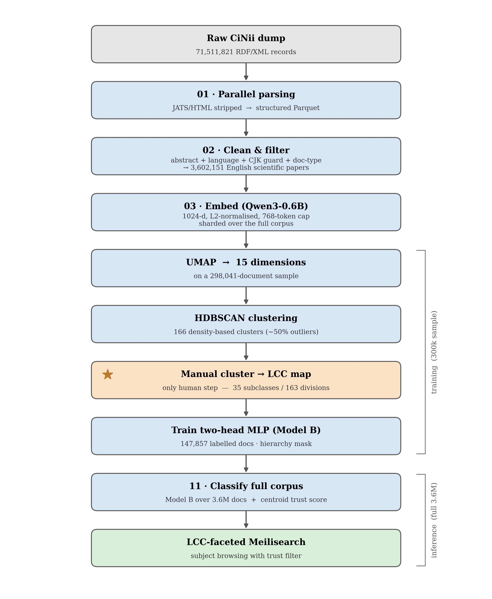

# CiNii Paper Classification

Subject classification of the **CiNii** database — Japan's national index of academic
literature — into **Library of Congress Classification (LCC)** codes.

The pipeline takes 71.5 million raw bibliographic records, reduces them to 3.6 million
English-language scientific papers, and assigns every one of them a two-level LCC code
(subclass + division). No labelled training data existed for this task, so the labels are
bootstrapped from unsupervised clustering and validated against an independently
constructed gold standard.

Sole researcher · National Institute of Informatics (NII), Tokyo.

---

## At a glance

| | |
|---|---|
| **Corpus** | 71,511,821 CiNii records → **3,602,151** classified English scientific papers |
| **Taxonomy** | Library of Congress Classification — **35 subclasses**, **163 divisions** |
| **Embeddings** | Qwen3-Embedding-0.6B — **1024-d**, L2-normalised, 768-token cap |
| **Topic discovery** | UMAP (1024→15) + HDBSCAN → **166 clusters** on a 298,041-doc sample |
| **Labelling** | LLM-assisted cluster→LCC mapping, expert-reviewed (87% of clusters corrected) |
| **Classifier** | Two-head MLP with hierarchy mask — **709K parameters** |
| **External accuracy** | **93.4% main class** / 78.6% subclass vs. a hand-built journal gold standard (1.42M papers) |
| **Throughput** | Full 3.6M-document corpus classified in **~8 minutes on CPU** |
| **Product** | LCC-faceted search interface over the classified corpus |

---

## Architecture



The design separates a **cheap, repeatable training loop** from an **expensive, one-time
embedding pass**. Embeddings for the full corpus are computed once (~80 GPU-hours, sharded
and resumable) and cached; every subsequent model iteration trains on a sample of those
cached vectors in seconds and re-classifies all 3.6M documents in minutes. Retraining the
taxonomy therefore costs minutes, not days.

Engineering properties that make this survivable at scale:

- **Resumable everywhere** — per-stage `run_state.json`, sharded Parquet with a manifest,
  single-shard repair mode. An 80-hour embedding job can be interrupted and resumed.
- **Atomic writes** — every Parquet write goes `.tmp` → `os.replace()`, so a crash never
  leaves a partial file that a resume would mistake for completed work.
- **Streaming throughout** — the 20 GB parsed corpus is never loaded into RAM; parsing,
  cleaning and reporting all iterate in batches (~2 GB peak vs. ~40 GB naive).

---

## Method

**1 · Parse and clean.** 71.5M RDF/XML records parsed in parallel (12 workers, ~10 h).
Records are reduced to English scientific papers with abstracts through a cascade of
filters: JATS/HTML stripping, uninformative-abstract removal, `langdetect`, a **CJK
character-ratio guard** (publishers frequently declare Japanese abstracts as `lang="en"` —
this caught ~108,000 such records), and a diagnostic-report title filter.

**2 · Embed.** Qwen3-Embedding-0.6B over the full 3.6M corpus, 1024-d, capped at 768
tokens (measured to truncate only 0.4% of abstracts). Output is sharded Parquet.

**3 · Discover topics.** UMAP to 15 dimensions, then HDBSCAN with a grid search over
`(min_cluster_size, min_samples)` scored by silhouette. The grid is defined as *fractions*
of sample size so cluster granularity stays stable as the sample scales. Result: 166
clusters on a 298,041-document sample.

**4 · Map clusters to LCC.** Each cluster is characterised by c-TF-IDF keywords and
mapped to an LCC subclass + division. Local LLMs (Qwen3 via Ollama) were evaluated for
this step and **rejected**: measured against a stronger model they collapsed ~85% of
clusters into a single dominant code (TK), ignoring explicit disambiguation rules. The
final mapping is LLM-bootstrapped and expert-corrected — 144 of 166 clusters (87%) were
changed during review. This is the only manual step in the pipeline.

**5 · Train.** A two-head MLP over frozen embeddings: shared backbone 1024→512→256
(BatchNorm, ReLU, dropout 0.3), then a 35-way subclass head and a 163-way division head,
with a **hierarchy mask** guaranteeing every predicted division is valid within its
predicted subclass. Trained on 147,857 labelled documents in 17 seconds on CPU.

**6 · Classify and serve.** Model B over all 3.6M documents (~8 min, CPU), each prediction
carrying a trust score (below). Output feeds a Meilisearch index with hierarchical LCC
facets, journal/publisher filters, and a trust-tier control.

---

## Evaluation

Because the labels are derived from the embeddings and the classifier predicts them from
the same embeddings, **internal validation accuracy is not a measure of correctness.** The
model reaches 96.1% agreement with the clustering on a held-out split — but a trivial 1-NN
lookup scores 97.4% on the identical split, which shows the task is separable by
construction. That number is reported here as *clustering fidelity*, not accuracy.

The real evaluation uses a signal the model never saw: **journal identity.**

**Independent gold standard.** The 200 highest-volume journals were labelled with their
true LCC subclass from journal scope and content — deliberately not from model output.
187 were labellable (13 multidisciplinary venues excluded), covering **1,416,940 papers**.
Paper-level prediction is then scored against its journal's independent label.

| | Main class | Subclass |
|---|---|---|
| Strict (single correct code) | **0.781** | 0.616 |
| Plausibility bucket (adjacent codes accepted) | **0.934** | 0.786 |

Residual disagreement is overwhelmingly *adjacent-category* — physiology↔medicine,
materials↔chemistry↔electronics, applied-physics QC↔TK — rather than outright error. A
measured 4.4% of gold papers are unwinnable: their correct subclass is absent from the
model's 35-class vocabulary (TP, GC, SF, TC, TS, VM, RJ).

**Calibrated abstention.** Softmax confidence proved useless as a quality filter (median
1.000; 79% of documents the clustering called noise were predicted at >0.9 confidence).
It was replaced with `pred_centroid_sim` — cosine similarity to the centroid of the
predicted division. Accuracy rises monotonically with it against external truth:

| Trust tier | % of corpus | Main class | Subclass |
|---|---|---|---|
| reject (<0.40) | 0.2% | 0.792 | 0.529 |
| low (0.40–0.57) | 15.5% | 0.899 | 0.655 |
| medium (0.57–0.67) | 49.0% | 0.937 | 0.781 |
| **trust (≥0.67)** | **35.3%** | **0.945** | **0.851** |

Corpus-wide, predictions also align with journal identity far above chance:
**AMI 0.316** and **16.75× lift** over random across 7,542 journals with ≥20 papers, while
the least coherent journals are exactly the multidisciplinary megajournals (*Nature
Communications*, *Science Advances*) — which is the correct behaviour.

---

## Repository layout

```
pipeline/     numbered stages 01–17 + orchestrators
              run_pipeline.py   local dev (parse→clean→embed)
              run_server.py     crash-safe full server run
              run_reembed.py    sharded 3M+ embedding, resumable
              run_training.py   sample→cluster→[manual map]→train
figures/      publication figure generators (data-driven + schematic)
search/       Meilisearch indexer + faceted web explorer
models/       released classifier artefacts
docs/         architecture diagram
lcc_mapping_corrected.csv   the reviewed 166-cluster → LCC mapping
```

## Reproducing

```bash
conda create -n cinii python=3.11 -y && conda activate cinii
pip install -r pipeline/requirements.txt      # requirements-server.txt for CUDA

# full pipeline: parse → clean → embed → classify
RAW_DIR=/path/to/cinii DEVICE=cuda python pipeline/run_server.py --run-name server

# retrain the taxonomy on cached embeddings
python pipeline/run_training.py --run-name v4 \
    --source data/embedded/corpus --sample-size 300000 --suggest-lcc models/release
# → fill in training_runs/v4/lcc_mapping.csv, then:
python pipeline/run_training.py --run-name v4 --train
```

Completed stages are detected and skipped, so any command above is safe to re-run after
an interruption.

## Limitations

- **English-only.** Of 71.5M records only 23.2M carry an abstract at all; the English
  filter leaves 3.6M. Japanese-language papers are largely out of scope, which skews the
  classified corpus toward STEM.
- **Vocabulary gap.** 7 LCC subclasses present in the gold standard are absent from the
  model's output space (~4.4% of gold papers cannot be scored correctly).
- **Known systematic error.** Bone/mineral research is absorbed into the dental cluster
  (*J. Bone and Mineral Research*: gold RC, ~91% predicted RK).
- **Coverage of the metric.** ~50% of the clustering sample are HDBSCAN outliers excluded
  from training; the journal evaluation, which covers 39% of the corpus regardless of
  outlier status, is the honest measure of how the model behaves on them.
